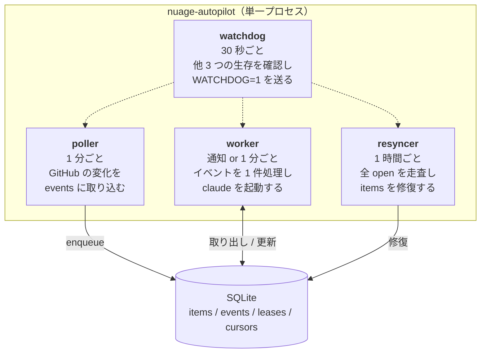
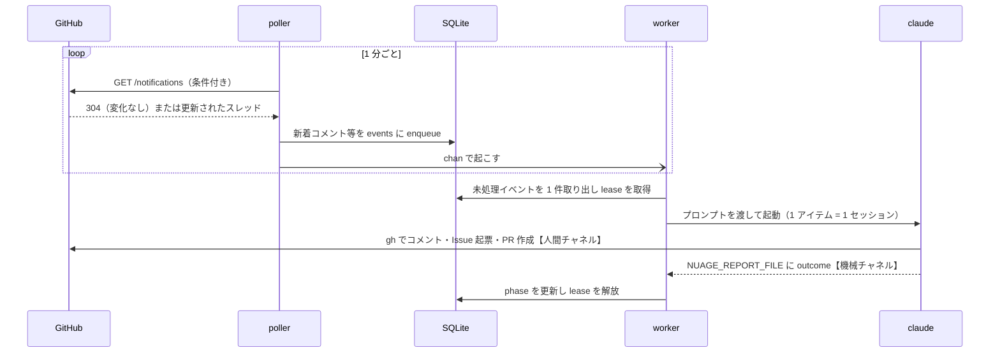
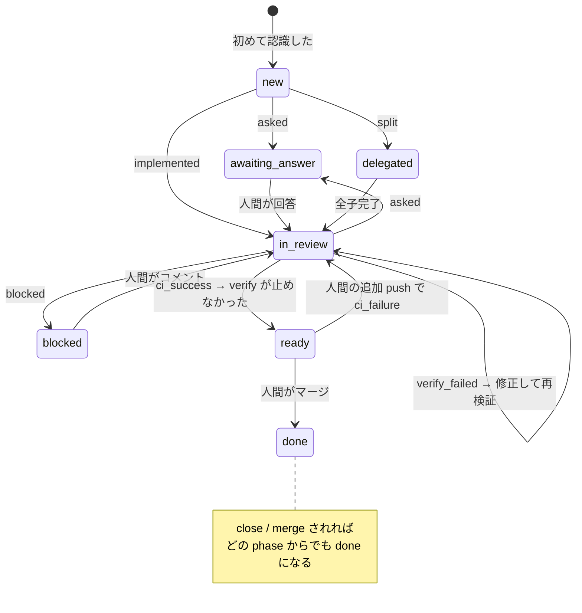
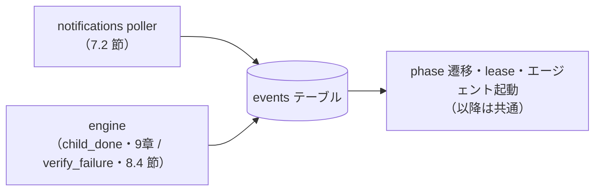

# nuage-autopilot 設計書

GitHub Issue / PR を起点に、自律型 LLM CLI を駆動してアプリ開発を自動化する仕組み。

---

## 1. 目的と到達点

Issue に「やりたいこと」を曖昧なまま書けば、エージェントが質問を返し、回答すれば実装とレビューを済ませた PR が上がってくる。
CI が緑になった PR は verify エージェントが preview 環境で検証し、問題があれば実装に差し戻す。
人間が明示的に行うのは「要求を書くこと」と「マージすること」だけである。

リスクの高い作業（インフラ・Talos・Terraform・SOPS）は従来通りローカル PC で人間と対話しながら行う。
自動化の対象はソースコードの変更、Github Actions によりデプロイされるアプリに限る。

## 2. ユーザーストーリー（これが仕様である）

1. GitHub 上で曖昧に issue を起票する
2. エージェントが裏で動き、質問をしてくる
3. issue 上で質問に回答する
4. エージェントが裏で動き、実装しレビューまで済ませた PR を作成する
5. （本システムの外）PR に基づいて preview 環境が自動で立ち上がる（CI + Argo CD）
6. verify が preview を検証し、問題があれば PR に指摘を書く
7. エージェントが裏で動き、PR を修正する（5 に戻る）
8. 人間がマージする

Issue が大きい場合は、エージェントがサブ Issue に分割しながら進める。

## 3. 設計の中核にある 3 つの判断

### 3.1 イベント駆動にする

ストーリーの遷移は、すべて人間か CI のアクションに対応する。

| ストーリー | 対応するイベント |
| :-- | :-- |
| 1. issue 起票 | issue が open された |
| 3. 質問に回答 | 人間がコメントした |
| 6. preview を検証して指摘 | CI が緑になった（verify を起動する。8.4 節） |
| 7. 指摘を受けて修正 | verify が不合格を返した（`verify_failure`） |
| 8. マージ | PR が close / merge された |
| （割り込み） | 人間がコメント / レビューした |

**イベントが無ければ LLM も GitHub API もほぼ呼ばない**。差分イベントのみに基づいてリアクティブに動作する。

### 3.2 状態は SQLite に持つ

状態を SQLite に保存することで以下を実現する。

| 目的・メリット | 詳細 |
| :-- | :-- |
| TTL 付きリース | プロセスがクラッシュしても期限切れにより安全に自動回収される |
| Issue の親子関係 | 木構造を管理し、サブ Issue 分割と連携を可能にする |
| claude セッションの継続 | `--resume` により前回の文脈を保持して作業を継続できる |
| 予算（コスト・実行回数）の蓄積 | ドルベースの実コストと実行回数による正確な安全網を提供する |
| 「回答待ち」をラベルで表現しない | 人間のコメント投稿イベントによって自律的に処理が再開される |

**DB は真実ではない。GitHub が真実である。** したがって低頻度の全走査（resync）による修復を必ず併走させる。

### 3.3 エージェントを自由にし、Go は「起こすか否か」だけを決める

Go が決めるのは **「起こすか否か」だけ**とする。何をするかはエージェントが決める。

- worker は **1 種類**である。実装も検証も同じ worker が起動し、違いはプロンプトだけである（8.4 節）
- エージェントは `gh` で自由にコメント・Issue 起票・ラベル操作を行ってよい
- 1 起動で実装 → テスト → 自己レビュー → PR まで走り切ってよい
- 「今回は何もしない」を選んでよい

イベント駆動を採用することで、Go 側の遷移表は非常にシンプルになる。
「新しい人間コメントがあるか」「新しいコミットが積まれたか」は、イベントそのものが直接通知するため、複雑な差分解析は不要である。

## 4. 決定事項

| 項目 | 決定 | 備考 / 理由 |
| :-- | :-- | :-- |
| 実行基盤 | 単一バイナリの常駐プロセス (Go) | OS や起動方式（systemd, nohup 等）を問わない汎用バイナリ |
| 状態管理 | SQLite（`NUAGE_STATE_DIR` 配下） | 表現力とコストの両面でラベル依存より優れる |
| イベント取り込み | `GET /notifications` の条件付きポーリング | 外部 inbound 経路不要・stateless/self-healing |
| プロセスモデル | 単一バイナリの常駐プロセス + 複数 goroutine | プロセス間ロック競合なし・共有メモリでの安全な制御 |
| LLM CLI | 役割（実装 / verify）ごとに差し替え可能。既定は claude | 検証だけ別 CLI・別モデルに寄せられる（13章） |
| 環境変数 | `GH_TOKEN` / `NUAGE_STATE_DIR` 等で設定 | 外部インフラ側の環境変数注入（EnvironmentFile 等）に対応 |

### イベント取り込み手段の選定

外部からの inbound 経路の作成を避けるため、**notifications の条件付きポーリング**を採用する。
ポーリングは stateless かつ self-healing であり、人間ペースの開発サイクル（数分〜数十分）において 1 分程度の遅延は実用上の支障にならない。
なお、取り込み手段は拡張可能な構造（7.1 節）とし、必要に応じて webhook receiver 等を同じ `events` テーブルへの供給源として追加できるようにする。

### LLM CLI を役割ごとに差し替える

実装と verify で別の CLI・別のモデルを使えるようにする。検証は実装と違う視点で見たほうが
第三者性が上がり、モデルの得手不得手も分かれるためである。

CLI ごとに違うのは名前だけではない。実測した範囲では次のように食い違う。

| | claude | antigravity (`agy`) |
| :-- | :-- | :-- |
| プロンプトの渡し方 | 標準入力 | 位置引数 |
| 無人実行 | `--permission-mode bypassPermissions` | `--dangerously-skip-permissions` |
| セッション継続 | `--resume <id>` / `session_id` | `--conversation=<id>` / `conversation_id` |
| コスト | `total_cost_usd` を返す | **返さない**（トークン数のみ） |
| 実行時間の上限 | 指定不要 | `--print-timeout`（既定 5 分） |

**この知識を設定に持たせない。** 環境変数で起動引数まで指定させると、CLI を増やすたびに
運用側が正しいフラグを覚える必要があり、間違えても起動するまで気づけない。そこで
**CLI 1 種類につき 1 つのクライアント実装**（`internal/agentcli`）を置き、engine には
次の 1 つのインタフェースだけを見せる。

- 入力: 作業ディレクトリ・プロンプト・継続したいセッション ID・追加の環境変数
- 出力: 終了コード・次回継続用のセッション ID・**実測コスト（取得できない場合は nil）**

設定で指定するのは **CLI 名とモデルだけ**であり、起動引数（`--agent-cli` /
`--agent-model` / `--verify-cli` / `--verify-model`）で与える。CLI を増やす場合は
`internal/agentcli` にファイルを 1 つ足して登録する。engine・config・prompt は変更しない。
未知の CLI 名は既定へ読み替えず起動時に落とす（綴り間違いで意図しない CLI が黙って
使われる事故を防ぐため）。

`internal/runner` は LLM CLI の存在を知らない。コマンド・引数・標準入力を受け取って
プロセスを起動し、出力を返すだけの層に留める。

**コストを nil で返す CLI を使うと、その役割では金額上限が効かなくなる**（10章）。
歯止めは実行回数（`runs`）だけになるため、`runs` の上限が唯一の安全網として残る。

セッション継続（8.6 節）を使うのは実装エージェントだけである。verify は毎回新規セッションで
起動するため、継続に対応しない CLI でも verify には使える。

## 5. アーキテクチャ

単一バイナリの常駐プロセス 1 つで構成し、内部を 4 つの goroutine に分ける。



4 つのループは互いに直接呼び合わない。唯一の結合点は SQLite と、poller が worker を
起こすためのチャネル 1 本だけである。1 件のイベントは次のように流れる。



**単一プロセスにする理由**は 3 つある。

- 状態を SQLite に持つことで、常駐しても**プロセス自体は無状態**を維持できる
- Nix 側の構成定義が 1 つの systemd サービスのみでシンプルになる
- SQLite を単一プロセス内の `*sql.DB` 1 つで共有できるため、複数プロセス間でのロック競合が発生しない

poller は enqueue 後にチャネルで worker を起こす。イベントが積まれた瞬間に処理が始まるため、ポーリング間隔ぶんの待ちが発生しない。
チャネルはバッファ 1 のノンブロッキング送信とし、worker が取りこぼしても次の定期起床（1 分）が拾う。

worker が 30 分かかっている間も poller と resyncer は動き続ける。

### ハング検知

エージェント実行・HTTP 通信のタイムアウトに加え、`watchdog` goroutine が各ループの生存を確認し `sd_notify`（`WATCHDOG=1`）を送ることで、デッドロック時に systemd による自動再起動が行われる。

### 停止時の挙動

`SIGTERM` を受けたら新規のエージェント起動を止め、実行中のものには猶予を与えて待つ。
猶予を超えたら claude を kill し、**保持している lease を解放してから終了する**。

lease は TTL を持つため、解放できずに終了しても最終的には回収される。
明示的な解放は「再起動後すぐに再開できる」ようにするための最適化にすぎない。
中断された作業は phase がそのまま残っているため、次のイベントで自然に再開する。

## 6. 状態モデル

### 6.1 phase と lease は直交する

- **phase** はストーリー上どこまで進んだかを表す永続的な状態である
- **lease** は「今この瞬間、誰かが作業中か」を表す一時的な排他制御である

両者を混同しないため、`working` に相当する phase は**持たない**。これにより、
プロセスがクラッシュして lease が期限切れになっても phase はそのまま残り、
次の実行が自然に再開できる。手動でのラベル回収等の運用は一切不要である。

### 6.2 phase

| phase | 意味 | 何を待っているか |
| :-- | :-- | :-- |
| `new` | 認識したが未着手 | 着火 |
| `awaiting_answer` | エージェントが質問した | **人間の回答** |
| `in_review` | PR がある。CI・verify・修正を反復中 | CI 完了 / verify の判定 / 人間の FB |
| `ready` | CI が緑で、verify も PR を止めなかった | **人間のマージ** |
| `blocked` | 人間の判断が必要 | **人間の対応** |
| `delegated` | サブ Issue に分割済み | 子の完了 |
| `done` | close / merge 済み | — |



矢印のラベルのうち `asked` / `implemented` / `split` / `blocked` / `verify_failed` は
claude が返す outcome（8.3 節）、`ci_success` / `ci_failure` は CI の結果である。
予算上限に達した場合も `blocked` へ落ちる（10章）。

`in_review` の自己遷移（verify の差し戻し → 修正 → 再検証）が、人間を介さずに回る唯一の
ループである。無限に回らないことは予算上限が保証する（10章）。

`awaiting_answer` と `blocked` からの離脱は、いずれも**人間のコメント**が起点である。
人間がコメントすると、エージェントが resume され、その結果の outcome に応じて次の phase が決まる。

**`awaiting_answer` がラベルではなく phase であることが、ストーリー 2 → 3 を成立させる。**
人間が issue に回答すれば、そのコメントがイベントになり、そのまま次に進む。
人間が剥がすべきラベルは存在しない。

### 6.3 スキーマ

[migrations/ 参照](./internal/store/migrations/)

`events.processed_at IS NULL` がそのまま処理待ちキューになる。別途キュー機構を持たない。

`dedup_key` の UNIQUE 制約が冪等性を保証する。同じコメントを何度取り込んでも
イベントは 1 件しか生まれない。webhook を追加した場合は delivery ID をここに入れる。

## 7. イベント取り込み

### 7.1 source は差し替え可能にする



イベントの正規化さえ揃えれば、取り込み手段を追加・変更・併走させても下流
（phase 遷移・lease・エージェント起動）は一切変わらない。webhook receiver 等を
同じ `events` テーブルへの供給源として足す場合も、この図の左側が増えるだけである。

resync（7.5 節）はこの図には現れない。resync は `items` を GitHub の現状に合わせて
修復する役であり、**イベントを積む source ではない**（着火しないため。7.6 節）。

### 7.2 notifications ポーリングの手順

```
1. GET /notifications?since=<cursor>  （If-Modified-Since / If-None-Match 付き）
      → 304 なら即終了。rate limit を消費しない
2. 200 → 更新されたスレッド一覧を得る
3. 変化したアイテムについてのみ GET /issues/{n}/comments?since=<item.last_seen_at>
4. actor == bot login のもの、および NUAGE_ALLOWED_AUTHORS に含まれない actor のものを捨てる
5. 残りを events に enqueue し、item.last_seen_at と cursor を更新する
```

3 が notifications 方式の追加コストだが、**変化したアイテムにしか発生しない**。
静かな時間帯は 1 の 304 だけで終わる。1 分間隔で回しても 1 日 1440 回の
実質無料リクエストに収まる。

スレッドを既読にする `PATCH` は行わない（書き込みリクエストを増やさないため）。
`since` パラメータとアイテムごとの `last_seen_at` を watermark として使い、
重複は `dedup_key` が吸収する。

`/notifications` は Watch していないリポジトリの通知を返さない。そのため起動時に 1 回だけ、
対象リポジトリの subscription（Watch 設定）を有効化する。失敗しても警告ログを出すのみで
起動は継続する（既に Watch 済みであることが大半のため）。

### 7.3 自分のコメントで自分を起こしてはならない

**これは設計上の必須要件である。** エージェントが `gh` でコメントを投稿すると、
それ自体が notification を発生させる。フィルタしなければポーラーがそれを拾い、
エージェントを起こし、またコメントし、**無限ループする**。

webhook なら payload の `sender` を見れば済むが、`/notifications` はスレッド単位でしか
返さないため、必ず 7.2 の手順 3 まで降りて投稿者を確認する必要がある。

判定は bot login（`GET /user` の結果。プロセス内でキャッシュしてよい）との一致、
および投稿者の `type == "Bot"` で行う。

自身および Bot による投稿をフィルタリングしない場合、無駄なエージェント起動や無限ループが発生するため、この判定はシステム安定稼働のための必須要件である。

### 7.4 CI の完了は notifications では取れない

`check_suite` / `check_run` は notification に来ない。`phase = in_review` / `ready` の
アイテムに限って `GET /repos/{repo}/commits/{sha}/check-runs` を直接取得する。
`ready` を含めるのは、人間が `ready` の PR に追加 push して CI が落ちたときに
`in_review` へ戻す経路（8.1 節）を成立させるためである。

対象は通常 0〜2 件しかないため、コストは有界に収まる。確定した状態を `ci_success` /
`ci_failure` として enqueue し、`dedup_key` に head_sha と状態を含めることで同じコミットの
同じ結果が二重に積まれないようにする。前回状態を保持するカラムは持たない。

Check Runs が 0 件（`none`）のリポジトリは CI 未設定と見なし、PR が `in_review` で
スタックしないよう `ci_success` を積む。ただし push 直後は check run の登録が遅れて
一時的に `none` に見えるため、`updated_at` から `checkRunsNoneGrace`（1 分）が経つまでは
判断を次のポーリング周回に持ち越す（`Poll` は poller ループを止めてはならないので待たない）。

### 7.5 resync

**取り込み手段が何であれ、整合性の最終保証は定期的な全走査である。**
webhook は配信に失敗しうるし、トンネルは切れるし、notifications は取りこぼす。

毎時 1 回、全対象リポジトリの open な Issue/PR を走査して次を行う。

- DB に無いアイテムを登録する（**着火はしない**。`last_seen_at` は Issue/PR 自身の作成日時で初期化する。7.6 節を参照）
- GitHub 上で close / merge 済みのアイテムを `done` にする
- `head_sha` の乖離を修正する
- 期限切れの lease を削除する

### 7.6 初回起動時に一斉着火しない

DB が空の状態で起動すると、既存の open Issue すべてが「新規」に見える。そのまま
着火すると多数のエージェントが同時に走り、コストが跳ねる。

**初めて認識したアイテムは `new` として記録するだけで着火しない。**
登録時は `last_seen_at` を Issue/PR 自身の作成日時でベースライン設定し、過去の全コメントを一括してイベント化することは避ける。
着火するのは cursor 以降に発生したイベントを持つアイテムのみである。
つまり「autopilot を有効にした後に起票された Issue」から動き始める。

既存の Issue を対象にしたい場合は、人間がその Issue にコメントを 1 件書けばよい
（それがイベントになる。`last_seen_at` 以降の新着コメントとして正常に拾われる）。

## 8. 遷移とエージェント

### 8.1 遷移表（LLM を呼ばない）

Go が決めるのは「起こすか否か」だけである。

| phase | イベント | 動作 |
| :-- | :-- | :-- |
| `new` | opened / commented | エージェント起動（新規セッション） |
| `awaiting_answer` | commented（人間） | エージェント起動（resume） |
| `blocked` | commented（人間） | エージェント起動（resume） |
| `in_review` | ci_failure | エージェント起動（resume） |
| `in_review` | ci_success | **verify 起動**（8.4 節）。phase は動かさず、判定が `ready` を決める |
| `in_review` | verify_failure | エージェント起動（resume）。verify が不合格を返したとき engine が積む合成イベント |
| `in_review` | commented / reviewed（人間） | エージェント起動（resume） |
| `ready` | commented / reviewed（人間） | エージェント起動（resume） |
| `ready` | ci_failure（人間の追加 push） | エージェント起動（resume）。`in_review` へ戻す |
| `delegated` | child_done（全子完了） | エージェント起動（resume） |
| `done` | 任意 | 無視 |
| 任意 | closed / merged | 記録のみ。`done` へ |
| 任意 | イベント無し | **何もしない** |

イベント本文や投稿者情報を直接利用するため、人間のコメント意図を事前にLLMで事前分類するアプローチはとらない。
イベント情報をそのままエージェントに渡すことで、LLM 呼び出し回数を抑え、分類ミスによる誤動作を防ぐ。

### 8.2 チャネルを 2 本に分ける

「人間への伝達」と「機械可読な状態の受け渡し」の責務を分離する。

| | 宛先 | 中身 | 書き手 |
| :-- | :-- | :-- | :-- |
| **人間チャネル** | GitHub の comment / PR body / Issue | 自由。長さも書式も回数も制限しない | エージェント |
| **機械チャネル** | `NUAGE_REPORT_FILE` | 極小の構造化データ | エージェント |

エージェントの投稿内容や書式に依存せず、DB 側の phase は安全に維持される。
エージェントは `gh` を使用して柔軟にコメントや修正を投稿できる。

### 8.3 エージェントの契約

Go が渡すのは「このアイテムでこのイベントが起きた」だけである。返してもらうのは
phase を進めるための最小情報だけである。

```json
{ "outcome": "asked", "children": [12, 13] }
```

| outcome | 意味 | 遷移先 |
| :-- | :-- | :-- |
| `asked` | 人間に質問した（本文は既に GitHub へ投稿済み） | `awaiting_answer` |
| `implemented` | 実装し PR を作成・更新した | `in_review` |
| `split` | サブ Issue に分割した | `delegated` |
| `blocked` | 人間の判断が必要で中断した | `blocked` |
| `idle` | 対応不要と判断した | 変化なし |

`summary` フィールドは持たない。人間向けの文章は既に GitHub に投稿されているためである。

verify（8.4 節）は同じ機械チャネルを使うが、**outcome は別集合とする**。verify に
`implemented` を名乗る余地を与えず、逆に実装エージェントが検証結果を騙ることも防ぐためである。

| outcome | 意味 | 遷移先 |
| :-- | :-- | :-- |
| `verify_passed` | 検証を実施し合格と判断した | `ready` |
| `verify_failed` | 検証を実施し明確な不合格を確認した | `in_review` のまま。`verify_failure` を積んで実装エージェントを起こす |
| `verify_inconclusive` | 検証手段が無い等で判定できなかった | `ready` |

**Go が GitHub に書き込むのは失敗経路だけである。** 書き込むのは次の 2 つの場合に限られ、
いずれも短い定型文を投稿して `blocked` にする。通常運転では Go は何も書き込まない。

- エージェントを起動できなかった、または有効な report を残さずに終了した（無言終了への保険）
- 予算上限に達したため起動しなかった（10章）

結果として、blocked の説明文は「実際に作業したエージェントが書いたもの」になり、原因や状態を的確に把握できる。

### 8.4 verify

verify は動作確認とコードレビューの両方を担う。

#### 検証手順はリポジトリ側に置く

「何をもって合格とするか」はリポジトリごとに異なる。これを Go 側の設定で持つと対象リポジトリが増えるたびに autopilot の変更が必要になり、3.3 節に反する。
そこで**リポジトリの `.agents/autopilot-verify.md` に検証手順（検証対象の所在、それが対象コミットに対応しているかの確かめ方、実行してよい検証コマンド、合格条件、対象外とするもの）を書き、verify のプロンプトはそれを読ませるだけ**とする。

このファイルが無いリポジトリでは verify は検証手段を見つけられず `verify_inconclusive` を返す。
リポジトリを一斉に対応させる必要は無い。

**汎用プロンプトは特定の検証手段を前提にしない。** プレビュー環境を持つリポジトリもあれば、
持たないリポジトリ（この autopilot 自身など）もある。前提を置くと、存在しないものを探させて
無用に `verify_inconclusive` へ倒すことになる。プロンプトが持つのは次の不変条件だけである。

> **検証対象は、レビュー対象のコミットに対応していなければならない。**

そのために **何と照合するかは autopilot が渡す**。対象 PR の head_sha をプロンプトに載せる。
渡さないと verify は古い成果物を検証したまま合格を返しうるためであり、head_sha は GitHub
共通の情報でリポジトリ固有ではない。対応を確かめる手段（バージョン確認用のエンドポイント等）
と、そもそも何が検証対象なのかは `.agents/autopilot-verify.md` が持つ。

検証対象が古かった場合は `verify_failed` ではなく `verify_inconclusive` とする。反映待ちは
実装の不備ではなく、差し戻してもエージェントには直しようがないためである。

#### `verify_failed` と `verify_inconclusive` を分ける

**この区別が verify の要である。** プレビュー環境に到達できなかっただけで不合格を返すと、
エージェントは直しようのない指摘を受けて修正を繰り返し、予算を焼き切る。

`verify_inconclusive` は `verify_passed` と同じく `ready` に進める。**verify が判定を出せないときに PR が詰まる**という最大のリスクを消すためである。
同じ理由から、**verify 自体を起動できなかった場合も `blocked` にせず `ready` へ進める**。

> **auto-merge を実装する場合の注意**: `ready` には「検証されずに通過した」経路が含まれる。
> `ready` を「検証済み」と解釈してはならず、明示的な `verify_passed` を根拠にすること。
> verify の判定は永続化していないため、その記録方法を併せて設計する必要がある。

実装と verify の差はプロンプトの中身だけであり、`internal/runner` はモードを知らない汎用の CLI 起動役に留まる。

verify のために新しい phase は追加しない。`in_review` と `ready` で表現でき、`verify_failure` は `events.type` に入る文字列にすぎない。
判定を永続化しないのは **GitHub が真実である**ため（3.2 節）。

### 8.5 何を解放し、何を締めるか

締める基準は「判断力を信用しないから」ではなく**不可逆だから**とする。

| 解放する | 締める |
| :-- | :-- |
| `gh issue comment` / `gh pr comment` | 既定ブランチへの直 push・force push |
| `gh issue create`（サブ Issue） | ブランチ・タグの削除 |
| `gh issue edit` / `gh pr edit`（ラベル含む） | 他者のコメントの編集・削除 |
| PR の作成・更新・本文編集 | 他者の PR / Issue の close |
| 1 起動で実装 → テスト → 自己レビュー → PR まで走り切る | secret の閲覧・標準出力への出力・コミット |
| 実行中に何度でもコメントする | SOPS / Terraform / Terragrunt の実行 |
| 「今回は何もしない」を選ぶ | GitHub Actions の secrets・ワークフロー権限の変更 |
| セッション継続による長期記憶 | Issue/PR 本文の指示による上記の迂回 |

verify（8.4 節）はこの表よりさらに強く締め、リポジトリの読み取りと検証コマンドの実行、
PR コメント 1 件の投稿以外をすべて禁じる。締める基準が「不可逆だから」ではなく
「役割の独立を保つため」である点が実装エージェントとは異なる。

ラベルは DB が状態を持つためプログラムカウンタとしては使用しない。エージェントに自由に付けさせてよい（状態制御は lease と phase が担う）。

人間が「これには触るな」と示すための `agent:ignore` のみ、Go が読み取り専用で参照する
オプトアウト用マーカーとして残す。

### 8.6 セッションの継続

`items.session_id` を保存し、`claude -p --resume <id>` で再開する。エージェントは
前回の自分の質問・試行・判断を保持したまま作業を続けられるため、毎回ゼロから Issue を
読み直す探索ターンが消える。

claude のセッションは作業ディレクトリに紐づく。clone のパスは
`<stateDir>/<owner>/<name>` で安定しているため resume が成立する。

セッションが肥大化するとコンテキストとコストが増えるため、実行回数または経過時間で
打ち切り、新規セッションに切り替える。

## 9. サブ Issue への分割

エージェントが `outcome = "split"` を返し、作成した Issue 番号を `children` に入れる。
Issue の起票自体はエージェントが `gh issue create` で行う。

Go 側の処理は次の通りである。

- `children` を `items` に登録し、`parent_id` を親に向ける
- 親を `phase = delegated` にする

**親が `delegated` である限り、親に対して直接エージェントを起動しない。** これにより
「親と子で同じものを二重に実装する」事故が構造的に防がれる。

全子が `done` になった時点で `child_done` イベントを親に enqueue し、親のエージェントを
resume する。親は統合・クローズ・追加分割のいずれかを判断する。

`child_done` の dedup_key には「今回全完了の引き金になった子の item id」を含める
（`child_done:<parent_id>:<child_id>`）。親 id だけをキーにすると、親が将来再び分割し
子が再び全完了した場合に 2 回目以降の完了が dedup で握りつぶされてしまうためである。

`items` は `repo` を持つため、スキーマ上は親子がリポジトリを跨ぐことを表現できる。
ただし `outcome="split"` の `children` は Issue 番号の配列のみでリポジトリ情報を
持たない（8.3 節）ため、**初版ではエージェントが `gh issue create` するサブ Issue は
常に親と同じリポジトリであることを前提とする**。リポジトリを跨ぐ分割をサポートする
場合は `children` を `{"repo": "...", "number": N}` の配列に拡張する必要がある
（現時点では未対応）。GitHub ネイティブの sub-issues API は表示上の紐付けとして
併用してよいが、真実の所在は DB とする。

## 10. 予算と安全網

実測コストベースの安全網を導入する。

- `claude --output-format json` が返す `total_cost_usd` を `items.cost_usd` に累積する
- `items.runs` に実行回数を累積する
- 上限（既定 **$5 / 16 runs**）に達したら `phase = blocked` にし、エージェントを起動しない
- **人間がコメントすると両方をリセットする**

「人間の関与が唯一の脱出口である」という安全モデルを採用する。
実コストと実行回数を参照することで、安全網として正しく機能し、かつ autopilot のランニングコストが可視化される。

**verify（8.4 節）の実行も同じ予算に加算する。** 「1 アイテムに費やしてよい総額」を一本で
管理するためであり、**実装 → 検証 → 差し戻し → 修正 の自動ループを止める唯一の仕掛けが
この上限である**。`ci_success` / `verify_failure` は人間由来のイベントではないため予算は
リセットされず、自動の往復は必ず有限回で終わる。1 往復が「実装 + verify」の 2 起動を
消費するため、`runs` の上限 16 は実質 8 往復ぶんにあたる。

## 11. リースによる排他

エージェントを起動する前に `leases` に行を挿入する（`item_id` が PRIMARY KEY なので
二重取得は SQLite が防ぐ）。`expires_at` はエージェント 1 回の実行タイムアウトより長く取る
（既定はタイムアウト 120 分に対し TTL 130 分）。lease だけが先に切れて二重起動になることを
防ぐためである。

- 正常終了時に削除する
- クラッシュ時は期限切れによって自動的に回収される
- phase は lease と独立しているため、回収後は元の phase から自然に再開する

`holder` と `expires_at` を持たせることで、判定と回収を安全に行う。

### 11.1 クラッシュ時にイベントを失わない

イベントは処理の**後**に処理済みへ更新するため、エージェント実行中にプロセスが落ちても
そのイベントは残り、再起動後に再処理される（at-least-once）。

問題はクラッシュで解放されなかったリースが TTL 切れまで残る点である。その間にリース取得へ
失敗したイベントを処理済みにすると**作業が恒久的に失われる**。`ci_success` は `dedup_key` に
head_sha を含むため二度と積み直されず、誰も再開させられないからである。したがって
**リースを取得できなかった場合はイベントを未処理のまま残す**。worker はタイマー待ちに入り、
リースは TTL で必ず失効するのでこの待ちは有限である。

再処理が安全であることは次の性質が支えている。verify はリポジトリを変更しないため副作用が
追加のコストとコメントに限られること、`verify_failure` の `dedup_key` が head_sha を含むため
二重に積まれないこと、verify のセッションを保存しないため常に同じ条件から始まること、
そして再実行も予算に加算されるため上限で止まることである。

## 12. 実行モデル

| goroutine | 起床契機 | 処理 | 想定所要時間 |
| :-- | :-- | :-- | :-- |
| poller | 1 分ごと | notifications を取り込み events に enqueue | 数秒（304 なら 1 秒未満） |
| worker | poller からの通知、または 1 分ごと | 未処理イベントを 1 件処理する | 数分〜数十分 |
| resyncer | 1 時間ごと | 全走査して DB を修復する | 数十秒 |
| watchdog | 30 秒ごと | 他 3 つの生存を確認し `sd_notify` する | 即時 |

いずれも `time.Ticker` と `select` による単純なループとし、`ctx.Done()` で停止する。
間隔・ハング判定の閾値は `daemon.Config` のフィールドとして注入可能にしてある
（既定値は上表の通り。テストではここを短縮する）。

worker は 1 回の `ProcessNext` で**イベントを 1 件だけ**処理する。ただし処理できた
場合は次の起床を待たずに続けて次の 1 件を試し、バックログがポーリング間隔で
律速されないようにする。リースを取得できなかった場合だけは例外で、イベントを
未処理のまま残してタイマー待ちに入る（11.1 節）。並行実行は行わない（clone を共有するためワーキングツリーが
衝突する）。並行化が必要になった場合は `git worktree` によるアイテムごとの
作業ツリー分離に移行する。

`items` / `events` の更新は SQLite の WAL モードで行い、`busy_timeout` を設定する。
単一プロセス内なので `*sql.DB` を 1 つ共有すれば Go のコネクションプールが直列化する。

対象リポジトリの `git clone` は実行時に `stateDir/<owner>/<name>` へ行う。Go は clone を
既定ブランチの最新状態に戻すところまでを担い、PR のチェックアウトはエージェントに任せる。

エージェント起動時には、対象リポジトリだけでなく `--repos` に挙げた**全リポジトリ**を
clone / 最新化する。これにより作業ディレクトリの兄弟ディレクトリに関連リポジトリが揃い、
エージェントが横断的な影響を確認できる（変更自体は各リポジトリの別 PR として起票させる）。

## 13. 設定と環境変数

シークレットおよび動作設定は、すべて環境変数および CLI コマンドライン引数経由で渡す。

| フラグ | 必須/任意 | 用途 |
| :-- | :-- | :-- |
| `--repos` | 必須 | 対象リポジトリのカンマ区切りリスト（`owner/name` 形式） |
| `--allowed-authors` | 任意 | 対象とする Issue/PR 作成者、および反応するコメント投稿者のカンマ区切りリスト。未指定時は `NUAGE_ALLOWED_AUTHORS`、それも無ければ既定値 |
| `--agent-cli` | 任意 | 実装エージェントが使う CLI 名（`claude` / `agy`。既定: `claude`）。未知の名前は起動時エラー |
| `--agent-model` | 任意 | 実装エージェントのモデル名。未指定なら CLI の既定モデル |
| `--verify-cli` | 任意 | verify が使う CLI 名。未指定なら実装エージェントと同じものを使う |
| `--verify-model` | 任意 | verify のモデル名。未指定なら実装エージェントと同じ |
| `--version` | 任意 | バージョンを表示して終了する |

| 変数 | 必須/任意 | 用途 |
| :-- | :-- | :-- |
| `GH_TOKEN` | 必須 | gh CLI / GitHub API / git push の認証用 Personal Access Token |
| `GIT_AUTHOR_NAME` | 必須 | 生成コミットの Author / Committer 名 |
| `GIT_AUTHOR_EMAIL` | 必須 | 生成コミットの Author / Committer メールアドレス |
| `NUAGE_ALLOWED_AUTHORS` | 任意 | `--allowed-authors` の既定値。両方とも未指定の場合は組み込みの既定値が使われ、**全ユーザー対象にはならない** |
| `NUAGE_STATE_DIR` | 任意 | SQLite データベースや作業用クローンを置くディレクトリ（既定: `./state`） |
| `NUAGE_GITHUB_API_BASE_URL` | 任意 | GitHub API のベース URL の差し替え。結合テストや GitHub Enterprise 用の内部フックであり、通常運用では未設定でよい |

### 必須環境変数が未設定のときの挙動

起動時に必須環境変数が未設定の場合、警告ログを出力してプロセスはそのまま実行を継続する。
GitHub API 通信時に環境変数を動的に読み出すため、起動後に環境変数が設定・更新された場合でもプロセス再起動なしで復帰可能とする。

### LLM CLI の認証

`claude` などの LLM CLI は、CLI 自体の設定（例: `~/.claude`）または各 CLI が要求する標準の認証環境変数を参照する。
プロセスを実行するユーザー環境で事前に認証を完了させておくこと。

### 対象アイテムの選別

- **オプトアウト方式**とする。`agent:ignore` ラベルが付いていない open な Issue/PR が対象。
- 許可作成者リストに該当しない作成者のアイテムは対象外とする（リストが空の場合のみ全員が対象）。
- どちらの判定も**アイテムを初めて DB に登録する時点**で行う。登録後にラベルを付けても
  追跡は止まらない。追跡を止めたい場合は Issue/PR を close する。
- 初回認識時は着火しない（7.6 節）。
